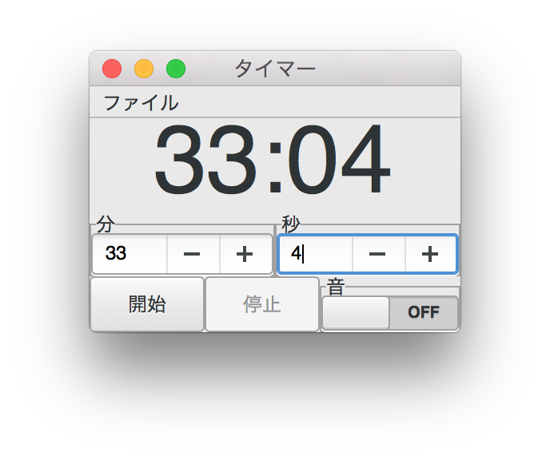

コミックマーケット89 で頒布した「実例で学ぶJulia GUI プログラミング Gtk.jl 版」のサンプルコードです。

[`Gtk.jl`](https://github.com/JuliaLang/Gtk.jl) を用いた、Julia 言語による簡単なタイマーアプリです。

`Gtk.jl` の他に`WAV.jl` が必要です。
ただし、`Gtk.jl` と`Base.Timer` （タイマー本体）と`WAV.wavplay` は相性が悪いのか、現状では完全にはうまく使えません。（タイマーを一回鳴らすだけなら問題ありません）

同梱の `default.wav` は[魔王魂](http://maoudamashii.jokersounds.com/)さまの作品です。
